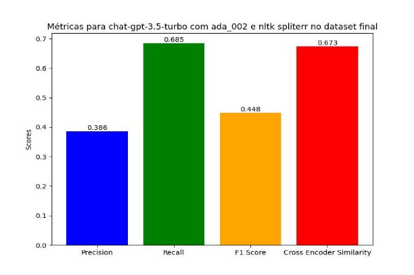

**Relatório - Construção de um chatbot baseado em IA para responder dúvidas sobre o vestibular da Unicamp 2024.**

Jonathan do Ouro

Large language models, como o Gpt-3, possuem conhecimento obtidos em seu treinamento e ficam armazenados em seus parâmetros, assim eles possuem um conhecimento congelado no tempo, tornando difícil realizar tarefas de domínio específico sem um fine-tuning. Dessa forma, para criar um chatbot que responda perguntas sobre o vestibular da Unicamp é utilizado a técnica de Retrieval Augmented Generation (RAG), que integra informações de domínio com um large language model, assim como demonstrado na figura 1.

Figura 1: Arquitetura de RAG utilizada para implementar o chatbot

Cada componente do sistema afeta a qualidade da resposta final, portanto é essencial realizar experimentos e avaliar com métricas a influência de cada um dos componentes nos resultados finais a fim de obter uma configuração ideal para o chatbot.

# Encontrando o melhor retriever

Dessa forma, foi realizado experimentos para encontrar uma boa configuração do sistema de retrieval. Nesses experimentos foi fixado o banco de vetores Chroma Db e averiguado a influência da função que quebra o texto grande em pequenos pedaços e os modelos geradores de embeddings, os componentes experimentados são:

1. Funções para dividir o texto completo da resolução do vestibular Unicamp em pedaços pequenos
   1. [NLTKTextSplitter](https://api.python.langchain.com/en/latest/text_splitter/langchain.text_splitter.NLTKTextSplitter.html)
   1. [RecursiveCharacterTextSplitter](https://python.langchain.com/docs/modules/data_connection/document_transformers/text_splitters/recursive_text_splitter)
   1. [llmsherpa](https://github.com/nlmatics/llmsherpa)
1. Modelo gerador de embeddings
   1. [text-embedding-ada-002](https://platform.openai.com/docs/guides/embeddings/what-are-embeddings)
   1. [multilingual-e5-large](https://huggingface.co/intfloat/multilingual-e5-large)

Para determinar qual das configurações era a melhor, foi desenvolvido manualmente um [dataset](processo_desenvolvimento/validacaoFinal.csv) que contém em cada tupla uma pergunta, trechos de textos relevantes para a pergunta e sua respectiva resposta. Assim, para cada pergunta foi feita uma busca semântica que retornava os textos mais similares, com esses textos da busca e os trechos relevantes associados a pergunta era calculado mean average precision, normalized discounted cumulative gain, recall at 3, precision at 3 e f1 score. Os resultados estão na figura 2.

Figura 2: Comparação de Métricas entre Diferentes Embeddings e Text Splitters no sistema de text retrieval

O uso do chat-gpt para esse processo foi fundamental, pois ajudou muito a implementar as funções que calculam as métricas e interpretar os resultados, além é claro de ter em primeiro lugar recomendado tais métricas. Assim, ficou definido utilizar o text splitter com NLTK e o modelo de embedding ada 002 da Open AI.

# Validação do chatbot

Uma vez definido o sistema de retrieval, foi avaliado a qualidade das respostas geradas pelo gpt-3.5-turbo, onde a avaliação foi feita utilizando o mesmo [dataset](processo_desenvolvimento/validacaoFinal.csv) mas dessa vez considerando os pares de perguntas e respostas.

O chat-gpt sugeriu algumas métricas como precision, recall e f1 score para computar a qualidade da resposta gerada em relação a resposta esperada considerando os tokens. Além disso, pesquisando na internet encontrei um [paper](https://arxiv.org/abs/2108.06130) que introduz uma métrica chamada SAS (Semantic Answer Similarity) para superar as limitações de comparações puramente lexicais, sendo esta métrica baseada em um [cross encoder](https://www.sbert.net/examples/applications/cross-encoder/README.html) (stsb-roberta-large) que mede a similaridade entre duas respostas.

Utilizando Langchain para fazer prompts para api do gpt-3.5-turbo foi feita a avaliação do chatbot e os resultados estão na figura 3.

Figura 3: Avaliação do chatbot

Dessa forma o chatbot final é construído com o Text Splitter da biblioteca NLTK, gerador de embeddings ada 002 da Open AI, banco de vetores Chroma DB e gpt-3.5-turbo como large language model.

# Considerações sobre o desenvolvimento

O processo de desenvolvimento e experimentos estão disponíveis em um [notebook](processo_desenvolvimento/chatbot.ipynb) do google colab e a implementação final esta principalmente na pasta Domain e no arquivo main.py

Para criar a aplicação final e realizar seu deployment, foi utilizado o framework Streamlit. Os dados que estão no banco de vetores que o App consulta foram gerados no [notebook](processo_desenvolvimento/chatbot.ipynb) e transferidos para o ambiente de produção somente uma vez, isto visando evitar que para todo usuário seja preciso gerar os embeddings novamente.

# Como utilizar o chatbot

Para utilizar o chatbot acesse esse [link](https://chatbot-unicamp.streamlit.app/):

Ou se preferir rodar localmente:
1. Clonar o repositório
2. Instalar todas dependências do arquivo [requirements.txt]
utilizando `pip install -r requirements.txt` no diretorio raiz.
3. Rodar o comando `streamlit run main.py` na raiz do projeto.
